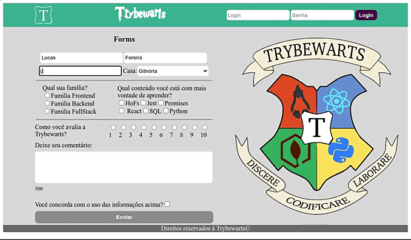

# Projeto Trybewarts

## Contexto
Este é um projeto desenvolvido quando estava cursando a [Trybe](http://www.betrybe.com) 
Trata-se de um site desenvolvido em HTML, CSS e JavaScript.
Neste projeto, você desenvolvemos uma página de formulário da Escola de Magia de Trybewarts, em que as pessoas estudantes podem enviar seus feedbacks sobre a escola. 

### Apresentação do Projeto Finalizado

## Técnologias usadas

Front-end:
> Desenvolvido usando: HTML, CSS, JavaScript

## Executando aplicação

* Para rodar o site:
  - Clonar o repositório para sua máquina ou fazer o download do arquivo "Download Zip" no botão "Code"
  - Ter a extensão "Live Server" do VSCode instalada
  - Abrir o projeto no VSCode, na raiz do diretório iniciar a extensão "Live Server" do VSCode

# Habilidades

Neste projeto, testamos os seguintes conhecimentos:

  * Criar formulários em HTML;

  * Utilizar CSS Flexbox para criar layouts flexíveis;

  * Criar regras CSS específicas para serem aplicadas a dispositivos móveis;

  * Construir páginas que alteram o seu layout de acordo com a orientação da tela;

